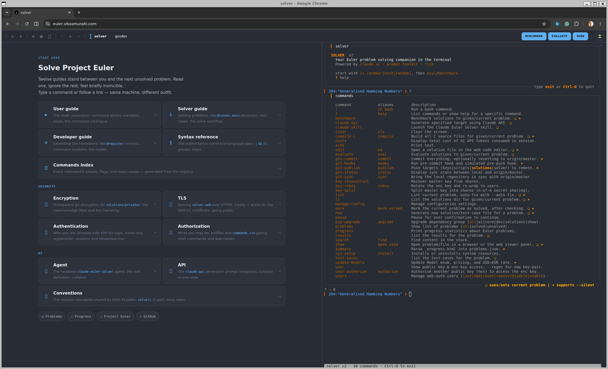

## Project Euler Solutions

[](https://www.python.org/downloads/)
[](LICENSE)

**Mathematics and computing are not separate disciplines - they are two lenses on the same underlying structure.**
Project Euler sits at that intersection: problems that look like puzzles but reward the kind of thinking that
distinguishes an engineer from a programmer. The right algorithm does not just run faster; it reveals why brute
force was never the right question.

This repository is a record of that journey. Where multiple approaches were tried, all are sometimes kept:
the naïve solution alongside the elegant one, because the contrast is the lesson.

The framework around the solutions is deliberate. Problems are fetched, the workspace is managed, solutions are
benchmarked, and solutions are encrypted – all from a single interactive/web shell. An incorporated AI agent enables
reflection and learning: explore alternatives after solving a problem, translate Python to C for a performance
comparison, or articulate the mathematical insight in plain language.
**The point never is to get an answer but to understand why it is the answer.**

*In accordance with [Project Euler's guidelines](https://projecteuler.net/about#publish), solutions and notes after the
first 100 problems are encrypted; for collaboration on those, please follow the instructions in
the [Key Exchange](docs/user-guide.md#7-key-exchange) section of the User Guide.*

---

### Documentation

The framework is documented in four guides under [`docs/`](docs/), plus the
authoritative command-language spec:

| Guide                                      | For                     | Covers                                                                           |
|--------------------------------------------|-------------------------|----------------------------------------------------------------------------------|
| [User Guide](docs/user-guide.md)           | using the shell         | launching, command blocks, variables, loops, the command catalogue, key exchange |
| [Solver Guide](docs/solver-guide.md)       | solving problems        | the `@runner.main` decorator, test cases, the `init → stack` workflow            |
| [Developer Guide](docs/developer-guide.md) | extending the framework | the `@register` contract, command modules, the module loader                     |
| [Command Index](docs/commands-index.md)    | reference               | every command's aliases, flags, and exact usage                                  |
| [Language reference](docs/syntax.md)       | the command language    | surface syntax, canonical form, semantics                                        |

The command catalogue and command index are regenerated from the live registry by the
`update-docs` shell command - `solver "update-docs"` after changing any command's name,
alias, help, or usage (`solver "update-docs --check"` fails if they are stale).

This README covers everything *outside* those guides: installation, dependencies, and the
design notes.

---

### Installation

Clone the repository and install system dependencies via [make](Makefile) or the bash [scripts](scripts);
the framework itself is installed with `pip`. Solutions can be written in any language – anything that runs as a
script or compiles to a binary will work.
The setup scripts and Makefile use `apt` and are tailored for Debian-based systems (Ubuntu). They are also
configured for Python and C, which is what I primarily use – feel free to adapt them for your own
OS, languages, and toolchains.
<details open>
<summary>one-line install (curl)</summary>

```bash
curl -fsSL https://raw.githubusercontent.com/vikasmunshi/euler/master/install.sh | bash
```

By default this clones to `~/euler` and runs `make install-all`. To choose a different path:

```bash
curl -fsSL https://raw.githubusercontent.com/vikasmunshi/euler/master/install.sh | bash -s -- --dir ~/projects/euler
```

</details>
<details>
<summary>or, install using make</summary>

```bash
git clone https://github.com/vikasmunshi/euler.git
cd euler
make --version >/dev/null || sudo apt install build-essential
mkdir workspace
make install-all      # system deps + venv + all groups + git hooks + completions
source .venv/bin/activate
solver
```

Use `make install-minimal` instead to skip dev tools, AI dependencies, git hooks, and completions.
</details>
<details>
<summary>or, install using scripts and pip</summary>

```bash
git clone https://github.com/vikasmunshi/euler.git
cd euler
./scripts/setup/dev_env.sh install python primesieve c
./scripts/setup/chrome.sh install
python3.14 -m venv .venv
source .venv/bin/activate
pip install -e ".[show,solutions]"   # add ai,dev groups for full install
solver
```

</details>

<a id="requirements"></a>
<details>
<summary><b>Requirements</b> - Python 3.14+ and optional dependency groups</summary>

Python 3.14+ and the dependencies listed in [`pyproject.toml`](pyproject.toml).
Dependencies are split into optional groups - install only what you need:

| Group       | Contents                                                                                                                 | When you need it                          |
|-------------|--------------------------------------------------------------------------------------------------------------------------|-------------------------------------------|
| *(base)*    | `beautifulsoup4`, `cryptography`, `flake8`, `jsonschema`, `mypy`, `prompt-toolkit`, `requests`, `rich`, `types-requests` | using the solver framework                |
| `solutions` | `cython`, `mpmath`, `numpy`, `primesieve`, `setuptools`                                                                  | running some solutions                    |
| `show`      | `matplotlib`, `pychrome`, `PyQt5`                                                                                        | graphical output (`--show`)               |
| `ai`        | `anthropic`, `python-dotenv`                                                                                             | only when running `claude-api`            |
| `dev`       | `autoflake`, `autopep8`, `black`, `isort`                                                                                | `lint --auto-fix` and solution formatting |
| `web`       | `aiohttp`                                                                                                                | for `solver-web`                          |

</details>

### Quick start

[](docs/screenshot.png)

```
$ solver
╭─ ▎ solver ───────────────────────────────────────────────────────────────────────────────────────────╮
│                                                                                                      │
│  SOLVER  v2                                                                                          │
│    Your Euler problem solving companion in the terminal                                              │
│    Powered by claude.ai · prompt-toolkit · rich                                                      │
│                                                                                                      │
│    start with init <number|next|random>, then eval / stack / reset                                   │
│    ? help                                                                                            │
│                                                                                                      │
╰──────────────────────────────────────────────────────────────────────── type exit or Ctrl-D to quit ─╯
▎ workspace ❯ loop {solved}: {
▎ ·   init {loop.number} --silent || continue;
▎ ·   benchmark --silent || break;
▎ ·   stack --silent && reset --silent || break;
▎ ·   }
```

Launch the web-based solver shell with `solver-web` or launch the interactive terminal with `solver` (or
`python -m solver`); Type `?` for the command list, `? <cmd>` for usage, and `exit` / Ctrl-D to quit. `solver` can also
be driven non-interactively by passing a quoted command block (`solver "init 42; eval; reset"`), exiting with the
block's status. The full workflow - `init`, `new`, `eval`, `benchmark`, `stack`, `reset` - is in
the [User Guide](docs/user-guide.md) and [Solver Guide](docs/solver-guide.md);
the [Command Index](docs/commands-index.md) lists every command.

A note on the AI assistance: two complementary paths are wired into the shell, both
aimed at deepening understanding rather than skipping it - the single-shot
**`claude-api`** (generate a solution, notes, or test cases) and the agentic
**`claude-skill`** / `! claude` (Claude Code working the locked workspace). Both need
the `ai` dependency group and an `ANTHROPIC_API_KEY`; see the
[User Guide](docs/user-guide.md#5-ai-assistance) for the trade-offs.

### For the nerds

- **Interactive shell** - `prompt-toolkit`-based REPL with persistent history, auto-suggest, tab
  completion (including bash-native completion for `!`-prefixed commands), `{name}` variables and
  side-effect-free expressions (comparisons, arithmetic, indexing/slicing, safe builtins), and a
  `loop <list>: <block>` construct over sliceable number lists (`{problems}`, `{solved}`, `{unsolved}`,
  `{stale}`). The command language - surface syntax, canonical form, and semantics - is specified in
  [`docs/syntax.md`](docs/syntax.md).
- **Rich UI** - `rich` panels, tables, and a themed colour palette throughout, so the terminal output is as
  readable as a rendered page.
- **Web front end** - `solver-web` runs a single localhost `aiohttp` server (port 8080) with three concerns
  in one place: a browser **terminal** (xterm.js over a PTY running a real `solver` shell), a read-only
  **viewer** that assembles each problem's page - statement, notes, and benchmark results - on the fly,
  decrypting encrypted problems in memory so nothing lands on disk, and an in-browser **editor** that saves,
  evaluates, and deletes solutions in the active workspace. It runs detached (survives the launching shell)
  and inherits the workspace lock; `solver-web start|stop|status|restart` manages it, and `show N` auto-starts
  it to open a problem (or the index) in the browser.
- **Problem scraping** - fetches and caches problem statements directly from projecteuler.net; no manual copy-paste.
- **Solution evaluation** - subprocess-based test harness with configurable timeouts, result recording, and support for
  any language that compiles or runs as a script.
- **Transparent encryption** - solutions for #101+ are encrypted at rest with AES-256-GCM; each file-encryption key is
  itself wrapped by a per-user master key, delivered via X25519 ECDH + HKDF-SHA256 + ChaCha20-Poly1305, with
  n-of-m secret sharing for master-key recovery.
- **AI Agents** - two paths to an agentic assistant:
    - the single-shot Claude **API** (`claude-api py|c|notes|test-cases`) for solutions and documentation,
    - and full **Claude Code** driven from the shell both interactively (`! claude`)
      and headless (`claude-skill <action>`, via the `claude-euler-solver` skill);
    - API token costs per `solver` session are tracked, use the command `costs` to show.
- **Performance dashboard** - benchmarks solutions and records execution times, building a personal history of the
  journey through the problems.

<details>
<summary>architecture &amp; package layout</summary>

<!-- GEN:package-layout -->
```
solver/
  __main__.py         — Module entry point.
  config.py           — Singleton Config: all paths, constants, command modules, and managed settings.
  main.py             — Entry point for the "solver shell" CLI.
  ai/
    api.py            — The `claude-api` command: generate solution artifacts (code / docs / test cases) via the Claude API.
    code.py           — Generate and re-document Project Euler solutions (Python and C) via the Claude API.
    docs.py           — Module to generate notes for solver solutions, leveraging AI.
    facts.py          — Utility function for gathering problem inputs for AI
    models.py         — Available models and their pricing, plus a utility function to calculate costs.
    skill.py          — The `claude-skill` command: run Claude Code in-shell against the locked workspace.
    update_models.py  — The `update-models` command: refresh the `Model` enum, pricing, and FX rate.
  core/
    checkout.py       — Workspace checkout marker: a presence-based guard that blocks `reset`.
    evaluate.py       — Solution evaluation: runs standalone scripts against test cases and reports results.
    lock.py           — Utilities for workspace locking using file-based locks.
    parser.py         — HTML problem-statement parser: assemble a standalone statement page from a scraped Project Euler page.
    problems.py       — The Problem model plus the projecteuler.net problem scraper and on-disk cache.
    results.py        — Results: save and retrieve problem results.
    stack.py          — Stack directory management: file read/write, transparent encryption, and path resolution.
    test_cases.py     — Load test cases for evaluation
    workspace.py      — Workspace management: initialise, stack, list, and clear problem workspaces.
  crypto/
    asymmetrical.py   — X25519 ECDH key pair generation, master key wrapping, and user identity management.
    keys.py           — Encrypted key file read/write and per-user key retrieval.
    share.py          — n of m secret sharing for fixed-size AES-256 keys.
    symmetrical.py    — AES-based symmetric encryption and decryption with key derivation.
  runners/
    migrate.py        — Migrate legacy solutions to the new runner framework.
    runner.h          — Runner framework for Project Euler solutions with benchmarking and validation.
    runner.py         — Runner framework for Project Euler solutions with benchmarking and validation.
  shell/              — Shell framework (prompt-toolkit + rich): the readline → lexer → parser → interpreter pipeline.
    bash.py           — The `!` (`sh` / `bash`) built-in command: run a bash command in the workspace.
    builtins.py       — Built-in framework commands for shell v2: echo, clear, help.
    command.py        — Command framework for shell v2: Context, Command, registry, and decorator.
    interpreter.py    — Interpreter for shell v2: execute the parser's statements.
    lexer.py          — Lexer for shell v2: syntax-check a command block and normalise it.
    parser.py         — Parser for shell v2: canonical form (the lexer's output) → typed statements.
    register.py       — The `@register` decorator: register a function as a shell command with type-safe coercion and completion.
    session.py        — Session capture: tee shell output and typed input to a plain-text log file.
    shell.py          — Interactive shell for v2: readline → lexer → parser → interpreter.
    tty.py            — Terminal I/O: the shared rich console, the prompt-toolkit session, and the command-block reader.
    variables.py      — Variable store for shell v2.
  templates/
    engine.py         — Template rendering: the Templates enum and string.Template engine with shared prompt/solution vars.
    new.c             — Solution to Euler $problem.
    new.py            — Solution to Euler $problem.
  utils/
    download.py       — Utility for downloading and caching files via HTTP.
    gh.py             — Utility to retrieve authenticated GitHub user's email and repository owner's email.
    linter.py         — Utilities for linting code.
    loader.py         — Utility for loading modules.
    misc.py           — The `problems`, `manage-config`, and `lock-status` commands.
    path_utils.py     — Utility functions for file and directory operations.
    scripts.py        — A set of utilities to manage Git repository workflows.
    search.py         — 'find' command: grep the solution stack for a regular expression.
    shell_utils.py    — Utility for running shell commands and capturing their output.
    show.py           — Browser utilities for visualizing solutions.
    solution_files.py — The `new` command and solution-file formatting (black / isort / autoflake).
    summary.py        — Progress: parse .progress.html into problems.json and refresh in-memory state.
    update_doc.py     — Regenerate the machine-maintained sections of the guides under `docs/`.
  web/
    app.py            — aiohttp application: the SolverShell terminal, its PTY WebSocket, and the viewer.
    cli.py            — `solver-web`: lifecycle for the PTY-backed SolverShell web front end.
    pty_bridge.py     — PTY bridge: run an interactive `solver` shell on a pseudo-terminal.
```
<!-- /GEN:package-layout -->

Every shell command is a plain Python function decorated with `@register(...)`
(defined in `solver/shell/register.py`, re-exported from `solver.shell`). The decorator handles
`shlex` tokenisation, type coercion (`Literal` / `bool` / `int` / `Optional`), and tab-completion;
commands are collected at import time, and `solver/modules.csv` lists the modules loaded
on startup. Framework built-ins (`echo`, `clear`, `?`, `!`) are registered the same way
from `shell/builtins.py` and `shell/bash.py`. The full contract is documented in
the [Developer Guide](docs/developer-guide.md).

Every command returns an `int` exit code (`0` = success), so the shell composes them into command
blocks - `;` (sequential), `&&` (on success), `||` (on failure), and `{ … }` groups - through the
`lexer → parser → interpreter` pipeline. `loop`, `break` / `continue` / `exit`, `{name}` variables, and
side-effect-free expressions are language constructs (not commands); `solver <cmd>` exits with the
block's status. The language is specified end-to-end in
[`docs/syntax.md`](docs/syntax.md).

</details>

### License

This project is licensed under the **MIT License**. See the [LICENSE](LICENSE) file for details.

### Third-party dependencies

The framework's Python dependencies are declared in [`pyproject.toml`](pyproject.toml), split into
the optional groups summarised under [Requirements](#requirements) above (`solutions`, `show`, `ai`,
`dev`, `web`) - install only what you need.

The web front end bundles its JavaScript/CSS assets locally so it runs fully offline, with no CDN
calls. These vendored assets live under `solutions/static-content/vendor/` - xterm.js (MIT),
highlight.js (BSD-3-Clause), CodeJar (MIT), MathJax (Apache-2.0), and Devicon (MIT). Each is
redistributed under its permissive license; the full license texts and an inventory of every file
are in the [vendor README](solutions/static-content/vendor/README.md).

### Authors

**Vikas Munshi** - [vikas.munshi@gmail.com](mailto:vikas.munshi@gmail.com)
If a problem catches your eye, or you want to collaborate on the encrypted ones, feel free to reach out.
Curiosity is always welcome and fun.

**Claude** (Anthropic) - pair-programmed the solver framework and AI integration from inside its own shell.

---
