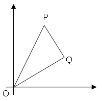
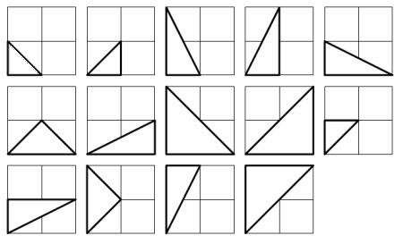

# 91 - Right Triangles with Integer Coordinates (level 6)

The points $P(x_1, y_1)$ and $Q(x_2, y_2)$ are plotted at integer co-ordinates and are joined to the origin, $O(0,0)$, to form $\triangle OPQ$.

There are exactly fourteen triangles containing a right angle that can be formed when each co-ordinate lies between $0$ and $2$ inclusive; that is, $0 \le x_1, y_1, x_2, y_2 \le 2$.

Given that $0 \le x_1, y_1, x_2, y_2 \le 50$, how many right triangles can be formed?