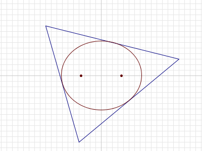

# 385 - Ellipses Inside Triangles (level 31)

For any triangle $T$ in the plane, it can be shown that there is a unique ellipse with largest area that is completely inside $T$.

For a given $n$, consider triangles $T$ such that:
- the vertices of $T$ have integer coordinates with absolute value $\le n$, and 
- the foci1 of the largest-area ellipse inside $T$ are $(\sqrt{13},0)$ and $(-\sqrt{13},0)$.
Let $A(n)$ be the sum of the areas of all such triangles.

For example, if $n = 8$, there are two such triangles. Their vertices are $(-4,-3),(-4,3),(8,0)$ and $(4,3),(4,-3),(-8,0)$, and the area of each triangle is $36$. Thus $A(8) = 36 + 36 = 72$.

It can be verified that $A(10) = 252$, $A(100) = 34632$ and $A(1000) = 3529008$.

Find $A(1\,000\,000\,000)$.

1The foci (plural of focus) of an ellipse are two points $A$ and $B$ such that for every point $P$ on the boundary of the ellipse, $AP + PB$ is constant.