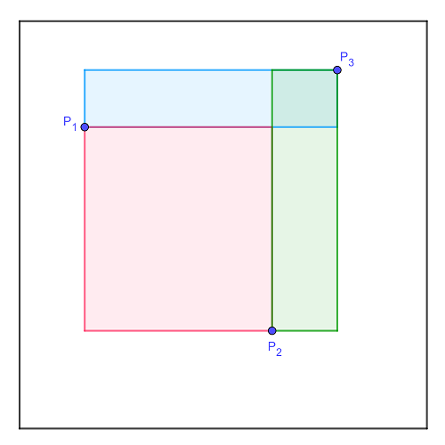

# 695 - Random Rectangles (level 32)

Three points, $P_1$, $P_2$ and $P_3$, are randomly selected within a unit square. Consider the three rectangles with sides parallel to the sides of the unit square and a diagonal that is one of the three line segments $\overline{P_1P_2}$, $\overline{P_1P_3}$ or $\overline{P_2P_3}$ (see picture below).

We are interested in the rectangle with the second biggest area. In the example above that happens to be the green rectangle defined with the diagonal $\overline{P_2P_3}$.

Find the expected value of the area of the second biggest of the three rectangles. Give your answer rounded to 10 digits after the decimal point.