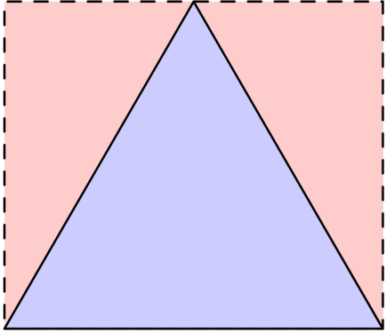
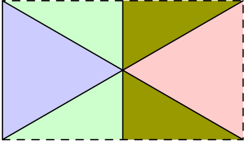
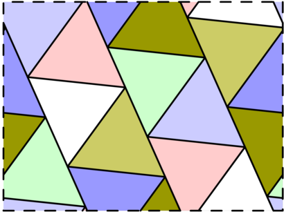
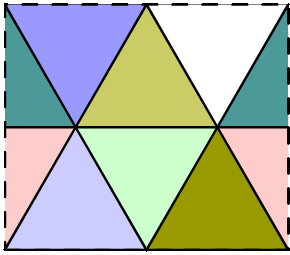
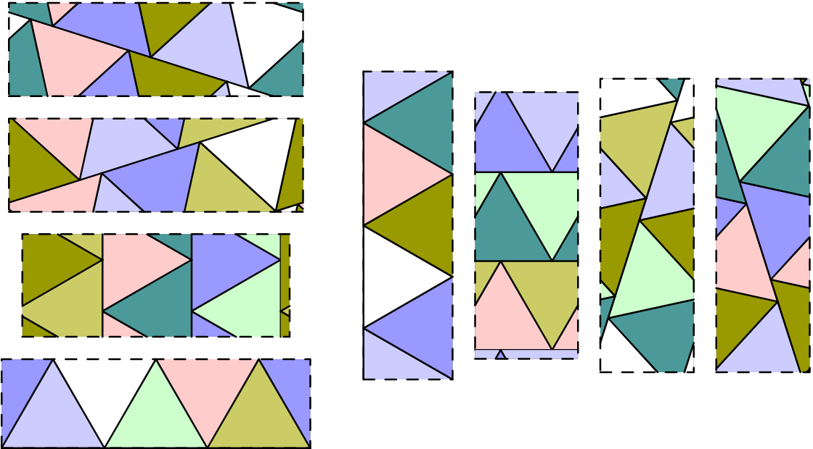

# 780 - Toriangulations (level 38)

For positive real numbers $a,b$, an $a\times b$ torus is a rectangle of width $a$ and height $b$, with left and right sides identified, as well as top and bottom sides identified. In other words, when tracing a path on the rectangle, reaching an edge results in "wrapping round" to the corresponding point on the opposite edge.

A *tiling* of a torus is a way to dissect it into equilateral triangles of edge length 1. For example, the following three diagrams illustrate respectively a $1\times \frac{\sqrt{3}}{2}$ torus with two triangles, a $\sqrt{3}\times 1$ torus with four triangles, and an approximately $2.8432\times 2.1322$ torus with fourteen triangles:

Two tilings of an $a\times b$ torus are called **equivalent** if it is possible to obtain one from the other by continuously moving all triangles so that no gaps appear and no triangles overlap at any stage during the movement. For example, the animation below shows an equivalence between two tilings:

Let $F(n)$ be the total number of non-equivalent tilings of all possible tori with exactly $n$ triangles. For example, $F(6)=8$, with the eight non-equivalent tilings with six triangles listed below:

Let $G(N)=\sum_{n=1}^N F(n)$. You are given that $G(6)=14$, $G(100)=8090$, and $G(10^5)\equiv 645124048 \pmod{1\,000\,000\,007}$.

Find $G(10^9)$. Give your answer modulo $1\,000\,000\,007$.