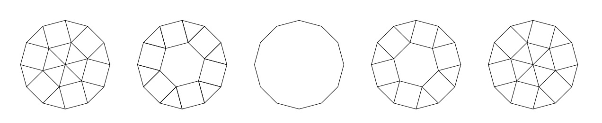

# 867 - Tiling Dodecagon (level 26)

There are $5$ ways to tile a regular dodecagon of side $1$ with regular polygons of side $1$.

Let $T(n)$ be the number of ways to tile a regular dodecagon of side $n$ with regular polygons of side $1$. Then $T(1) = 5$. You are also given $T(2) = 48$.

Find $T(10)$. Give your answer modulo $10^9+7$.