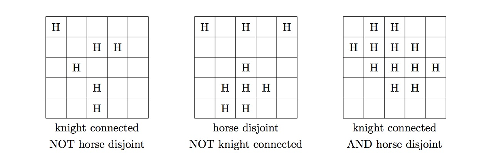

# 984 - Knights and Horses (level --)

In Western chess, a knight is a piece that moves either two squares horizontally and one square vertically, or one square horizontally and two squares vertically, and is capable of jumping over any intervening pieces.

Chinese chess has a similar piece called the horse, whose moves have an identical displacement as a knight's move; however, a horse, unlike a knight, is unable to jump over intervening pieces.

More specifically, a horse's move consists of two steps: An orthogonal move of one square, followed by a diagonal move by one square in the same direction as the orthogonal move. If the orthogonal square is occupied by another piece, the horse is unable to move in that direction.

Specifically the horse in the centre of the above board can move to the squares $b_{11},b_{12},b_{21},b_{22},b_{31},b_{32},b_{41},b_{42}$ providing the squares $a_{1},a_{2},a_{3},a_{4}$ are unoccupied. For example, if $a_2$ was occupied then it could not move to $b_{21}$ or $b_{22}$.

A set of squares on a chessboard is called **knight-connected** if a knight can travel between any two squares in the set using only legal moves without using any squares not in the set.
A set of squares on a chessboard is called **horse-disjoint** if, when a horse is placed on every square in the set (and no other square), no horse can attack any other.

Let $f(N)$ be the number of knight-connected, horse-disjoint non-empty subsets of an $N\times N$ chessboard. For example, $f(3) = 9$, consisting of the nine singleton sets. You are also given that $f(5) = 903, f(100) = 8658918531876$, and $f(10000) \equiv 377956308 \bmod 10^9+7$.

Find $f(10^{18})$. Give your answer modulo $10^9+7$.