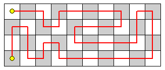

# Tours on a $4 \times N$ Playing Board

Let $T(n)$ be the number of tours over a $4 \times n$ playing board such that:

The tour starts in the top left corner.
The tour consists of moves that are up, down, left, or right one square.
The tour visits each square exactly once.
The tour ends in the bottom left corner.
The diagram shows one tour over a $4 \times 10$ board:

$T(10)$ is $2329$. What is $T(10^{12})$ modulo $10^8$?