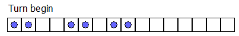
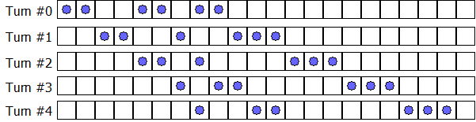

# Box-Ball System

Consider an infinite row of boxes. Some of the boxes contain a ball. For example, an initial configuration of 2 consecutive occupied boxes followed by 2 empty boxes, 2 occupied boxes, 1 empty box, and 2 occupied boxes can be denoted by the sequence (2, 2, 2, 1, 2), in which the number of consecutive occupied and empty boxes appear alternately.

A turn consists of moving each ball exactly once according to the following rule: Transfer the leftmost ball which has not been moved to the nearest empty box to its right.

After one turn the sequence (2, 2, 2, 1, 2) becomes (2, 2, 1, 2, 3) as can be seen below; note that we begin the new sequence starting at the first occupied box.

A system like this is called a **Box-Ball System** or **BBS** for short.

It can be shown that after a sufficient number of turns, the system evolves to a state where the consecutive numbers of occupied boxes is invariant. In the example below, the consecutive numbers of **occupied boxes** evolves to [1, 2, 3]; we shall call this the final state.

We define the sequence {*t**i*}:

*s*0 = 290797
*s**k*+1 = *s**k*2 mod 50515093
*t**k* = (*s**k* mod 64) + 1

Starting from the initial configuration (*t*0, *t*1, …, *t*10), the final state becomes [1, 3, 10, 24, 51, 75].
Starting from the initial configuration (*t*0, *t*1, …, *t*10 000 000), find the final state.
Give as your answer the sum of the squares of the elements of the final state. For example, if the final state is [1, 2, 3] then 14 ( = 12 + 22 + 32) is your answer.