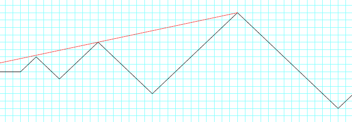

# Prime Mountain Range

A **mountain range** consists of a line of mountains with slopes of exactly $45^\circ$, and heights governed by the prime numbers, $p_n$. The up-slope of the $k$th mountain is of height $p_{2k - 1}$, and the downslope is $p_{2k}$. The first few foot-hills of this range are illustrated below.

Tenzing sets out to climb each one in turn, starting from the lowest. At the top of each peak, he looks back and counts how many of the previous peaks he can see. In the example above, the eye-line from the third mountain is drawn in red, showing that he can only see the peak of the second mountain from this viewpoint. Similarly, from the $9$th mountain, he can see three peaks, those of the $5$th, $7$th and $8$th mountain.

Let $P(k)$ be the number of peaks that are visible looking back from the $k$th mountain.  Hence $P(3)=1$ and $P(9)=3$.
Also $\displaystyle \sum_{k=1}^{100} P(k) = 227$.

Find $\displaystyle \sum_{k=1}^{2500000} P(k)$.