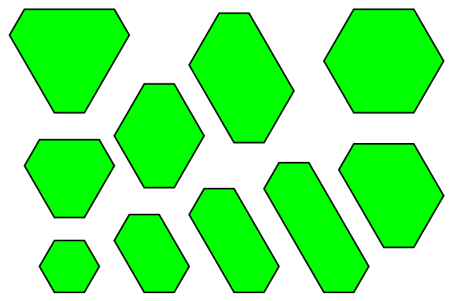

# Integer Sided Equiangular Hexagons

Let $H(n)$ be the number of distinct integer sided equiangular convex hexagons with perimeter not exceeding $n$.
Hexagons are distinct if and only if they are not congruent.

You are given $H(6) = 1$, $H(12) = 10$, $H(100) = 31248$.
Find $H(55106)$.

*Equiangular hexagons with perimeter not exceeding $12$*