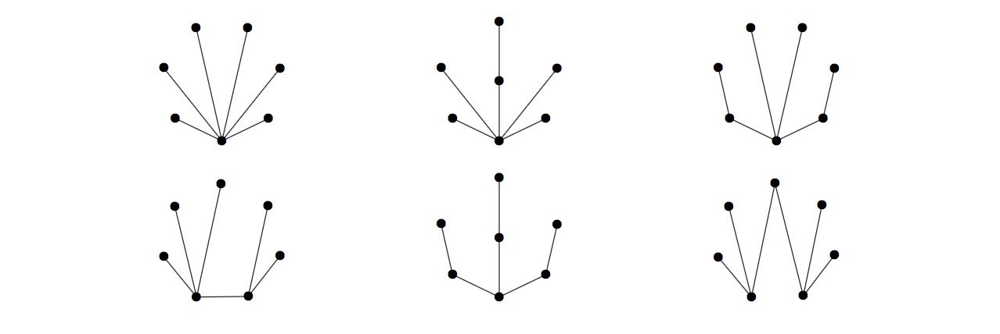

# Peerless Trees

A *peerless tree* is a tree with no edge between two vertices of the same degree. Let $P(n)$ be the number of peerless trees on $n$ unlabelled vertices.

There are six of these trees on seven unlabelled vertices, $P(7)=6$, shown below.

Define $\displaystyle S(N)  = \sum_{n=3}^N P(n)$. You are given $S(10) = 74$.

Find $S(50)$.