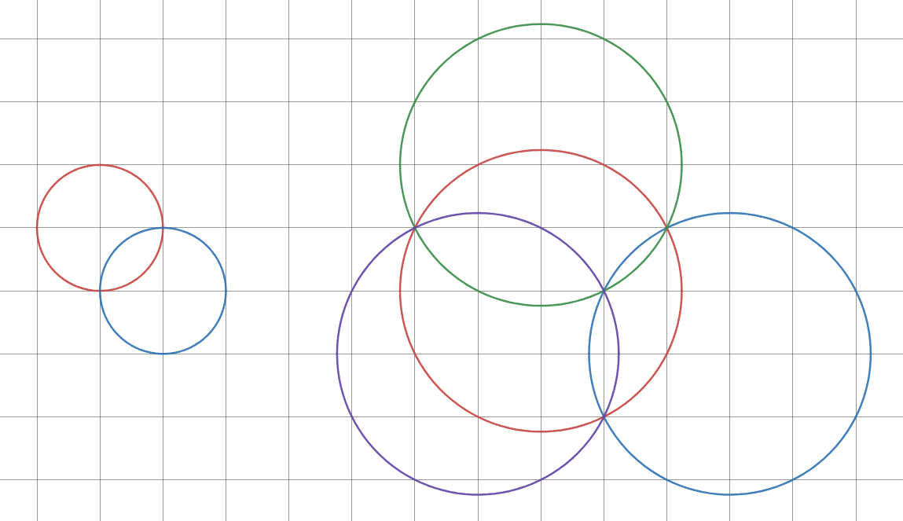

# Consonant Circle Crossing

We say two circles on the plane *harmonise* if the circles intersect at two grid pointsA point with integer coordinates, in which case the two intersection points are called the *harmony points*.

A set of circles on the plane is called *consonant* if it satisfies all the following requirements:

There are at least two circles in the set.
The center point of every circle is a grid point.
All circles have the same radius.
No circle is tangent to any other circle.
The circles are connected in the sense that a chain of circles can be formed between every pair of circles such that each circle harmonises with the next circle.

It can be proven that the number of unique harmony points of a consonant set of circles cannot be smaller than the number of circles. If the number of unique harmony points equals the number of circles, we say the consonant set is *perfect*.

For example, here are two perfect consonant sets of circles:

Let $R(n)$ be the minimal radius $r$ such that a perfect consonant set of $n$ or more circles with radius $r$ exists.
You are given $R(2) = 1$ and $R(4) = \sqrt{5}$.

Find $R(500)^2$.